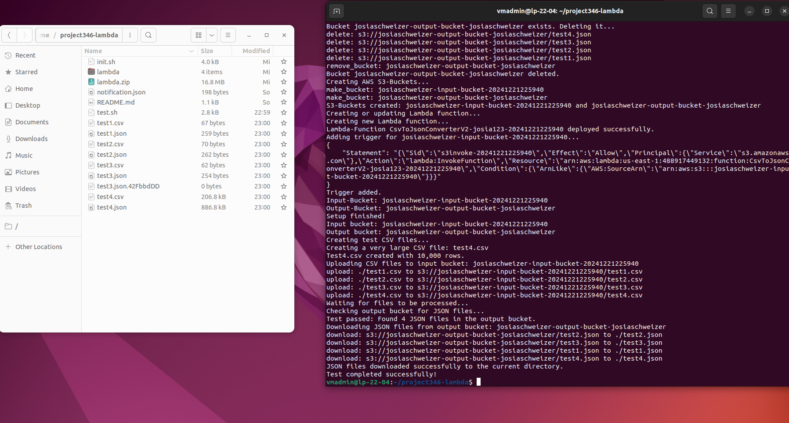

# Projekt 346: Lambda - CSV zu JSON Konvertierungsdienst

## **Projektübersicht**

### **Ziel**:

Dieses Projekt stellt einen CSV-zu-JSON-Konvertierungsdienst in AWS Lambda zur Verfügung, der automatisch ausgelöst wird, wenn CSV-Dateien in einen S3-Bucket hochgeladen werden. Die Lambda-Funktion konvertiert die CSV-Datei und speichert das Ergebnis als JSON-Datei in einem anderen S3-Bucket.

### **Technologien:**

- AWS S3
- AWS Lambda
- AWS CLI
- Node.js
- (Node Modules im .zip File hochladen)

### **Funktionsweise:**

Die Lambda-Funktion wird ausgelöst, wenn eine CSV-Datei in den Input-S3-Bucket hochgeladen wird. Die Funktion konvertiert die CSV-Daten in JSON und speichert die resultierende JSON-Datei im Output-S3-Bucket.

---

## **Setup und Konfiguration**

### **1. Voraussetzungen:**

- **AWS CLI** muss auf deinem lokalen Computer installiert sein.
- Du musst ein AWS-Konto haben und über die entsprechenden Anmeldeinformationen verfügen.

### **2. AWS CLI Installation:**

Installiere die AWS CLI auf deinem Computer. Für Ubuntu (und andere Debian-basierte Distributionen) kannst du den folgenden Befehl verwenden:

```
sudo apt install awscli
```

### **3. AWS Konfiguration:**

Du kannst die AWS CLI entweder mit dem Befehl `aws configure` oder durch direkte Bearbeitung der Konfigurationsdateien im Ordner `.aws` konfigurieren.

- **Option 1:** Führe `aws configure` aus und gib deine Zugangsdaten ein:
    - Access Key ID
    - Secret Access Key
    - Standardregion
    - Ausgabeformat (z. B. `json`)
- **Option 2:** Bearbeite direkt die Dateien `~/.aws/credentials` und `~/.aws/config`.
- Erstelle einen Input-Bucket für CSV-Dateien und einen Output-Bucket für die JSON-Dateien.

---

## **Lambda Funktion**

### **Beschreibung:**

Die Lambda-Funktion übernimmt den eigentlichen Teil des Services, nämlich die Konvertierung von CSV in JSON. Sie wird mit Node.js implementiert und durch das Hochladen einer CSV-Datei in den Input-Bucket automatisch ausgelöst.

### **Herausforderungen:**

- Zu Beginn war unklar, wie die Funktionalität zu implementieren ist.
- Mit Hilfe von Vorlagen und Rücksprache mit erfahrenen Kollegen konnte die Funktionalität erfolgreich implementiert werden.

### **Implementierungsschritte:**

1. Erstelle die Lambda-Funktion in der AWS Management Console oder über die AWS CLI.
2. Implementiere die Konvertierungslogik in Node.js.
3. Verknüpfe die Funktion mit dem Input-Bucket über einen S3-Trigger.

---

## **Init Script**

### **Beschreibung:**

Das Init Script ist entscheidend für die Einrichtung des Services. Es erstellt die erforderlichen Buckets und richtet die Lambda-Funktion ein.

### **Entwicklung:**

- Die Hauptfunktion besteht darin, die Basisressourcen zu erstellen und die Konvertierungsfunktion zu aktivieren.

---

## **Testfälle**

1. **Testfall: Hochladen einer korrekten CSV-Datei**
    - **Erwartetes Ergebnis:** JSON-Datei wird im Output-Bucket gespeichert.
2. **Testfall: Verarbeitung grosser CSV-Dateien**
    - **Erwartetes Ergebnis:** Datei wird erfolgreich verarbeitet und als JSON gespeichert.

---

## Test



Hier kann man die Testausgabe und die Files sehen, welche beim Test erzeugt wurden. Zum einen die 4 CSV Files, zum anderen die 4 JSON Files. Der Test wurde um 11.14 Uhr am 21.12.2024 gemacht. Wir haben 1 Testfile bzw. Testscript gemacht, welches 4 CSV to JSON konvertiert, davon ist ein CSV besonders gross um auch die Geschwindigkeit zu testen.

```html
name,age,city
John,25,New York
Alice,30,Los Angeles
Bob,22,Chicago
```

Hier kann man das CSV File sehen, welches generiert wurde.

```json
[
    {
        "name": "John",
        "age": "25",
        "city": "New York"
    },
    {
        "name": "Alice",
        "age": "30",
        "city": "Los Angeles"
    },
    {
        "name": "Bob",
        "age": "22",
        "city": "Chicago"
    }
]
```

Hier kann man das konvertierte JSON sehen, welches, wie man sehen kann, korrekt konvertiert wurde.

---

## **Reflexion**

### **Herausforderungen:**

- Fehlannahme, dass die Buckets separaten Code benötigen. Erst durch Experimente und Anpassungen wurde klar, dass die Funktionalität direkt durch das Init Script und die Lambda-Funktion übernommen werden kann.

### **Lessons Learned:**

- Eine klare Struktur und Planung sind essenziell, um Missverständnisse und unnötige Arbeitsschritte zu vermeiden.
- Die Kombination aus Eigeninitiative und gezielter Nutzung von Hilfsmitteln wie ChatGPT ermöglicht eine effiziente Problemlösung.

### **Zukünftige Verbesserungen:**

- Erweiterung des Services zur Verarbeitung weiterer Dateiformate.
- Hinzufügen von Logging und Monitoring für eine bessere Nachverfolgung.
- Implementierung von Berechtigungsmechanismen, um den Zugriff auf die Buckets und die Funktion zu sichern.